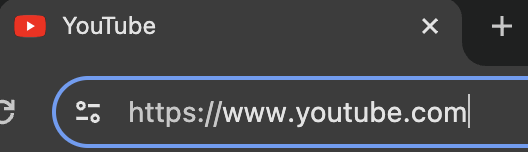

# Vad är en Webbserver?
Väldigt kortfattat så är en webbserver en dator med en specifik typ av mjukvara som används tillhandahåller hemsidor. Det kan med andra ord vara en laptop eller vanlig stationär dator hemma hos någon. I verkligheten så ser det inte ut så utan snarare något i stil på bilden nedan. 

Här ser vi hundratals rackskåp som i sin tur kan husera upp till ett fyrtiotal datorer. Alla datorer behöver inte vara dedikerade webbservrar utan kan vara till för annat som till exempel tunga beräkningar.
## Lite termer
Det finns otroligt många termer gällande webben, vi behöver inte kunna alla och ibland kommer vi blanda ihop dessa. Det finns en stor risk att jag kommer använda samma ord för olika saker.
+ **Domännamn - Domain namn**: Ofta bara kallat domän, är ett sorts adress och identitet på Internet. Vi använder domännamnet för att nå resurser som till exempel www.youtube.com eller www.svt.se. Bakom denna läsliga text finns det in IP-adress kopplad som tar oss till rätt ställe.
+ **Webbplats - Website**: Ofta kallad hemsida eller site. En samling av sidor som hör ihop med varandra samlade under en domän.
+ **Webbsida - Webpage**: En enskild sida av en webbplats.
+ **Webbserver - Web server**: En dator som men hjälp av specifik mjukvara tillhandahåller hemsidor.
+ **URL - Unified Resource Locator**: En textsträng som pekar på en specifik resturs på, ofta en webbsida. Exempel på en URL som pekar på en bild: https://media.cnn.com/api/v1/images/stellar/prod/150324154003-01-internet-cats-restricted.jpg

## Hur det funkar

### Klient
Vi använder oss av webbservrar dagligen som klienter. Varje gång vi surfar till en hemsida så skickar vi en förfrågan till en adress, närmare bestämt en ```HTTP```-förfrågan, HTTP Request på engelska. Det gör vi genom att vi skriver in en URL i adressfältet på vår webbläsare. 

Sökvägarna till filer på din dator är också URL:er, ```C:/apache24/conf/httpd.conf``` till exempel, kan du se några likheter eller olikheter med URL:en på bilden nedan?
Det kan du se i början på adressen till hemsidan, moderna browsers döljer det ofta dock så du kan behöva klicka på adressfältet för att kunna det se det. S:et i ```HTTPS``` indikerar att det är en säker (krypterad) förfrågan som sker.



Vi behöver inte längre skriva varken ```http/https``` eller ```www``` i våra adresser, våra webbläsare antar att det är en ```HTTP```-förfrågan vi vill göra. Du har kanske öppnat en PDF i din webbläsare utan att ha tänkt på vad som händer uppe i adressfältet. Så inleds inte URL:en längre med ```https``` utan ser istället ut till exempel såhär ```file:///Users/jonken/Documents/cats.pdf```. Precis som när vi surfar till en hemsida så pekar vi fortfarande på en specifik resurs, i det här fallet filen ```cats.pdf```.

### Server
När en HTTP-förfrågan tas emot av en server kommer den tolka den angivna URL:en och försöka hitta resursen som efterfrågats. Det finns flera olika tekniker för hur man formar URL:er vilket leder till att olika servrar kommer ha lika tekniker för att hitta rätt.

I den här adressen ```https://www.youtube.com/watch?v=dQw4w9WgXcQ``` så kan vi se att vi är på webbplatsen Youtube och mer specifikt att vi har gjort en förfrågan till sidan ```/watch```. Vi kan också se en ```GET```-parameter efter frågetecknet där ```v``` är namnet på parametern och ```dQw4w9WfXcQ``` är dess värde. Med hjälp av den här informationen vet Youtube vilken _sida_ det är du förfrågar och i det här fallet även vilken _data_ sidan är beroende av: Tillsammans bildar den efterfrågade _resursen_. Det här är därför en [*dynamisk webbserver*](2.%20Dynamiska%20och%20Statiska%20Webbservrar.md) eftersom innehållet på sidan ```/watch``` ändras beroende på parametrar i URL:en. 

_Testa att gå till Youtube eller Google, vad händer egentligen i adressfältet när du söker? Ser du några parametrar? Isåfall, vad händer om du ändrar på dom?_

Webbplatsen kommer försöka leta reda på den efterfrågade resursen och sedan skicka tillbaka ett HTTP-svar (HTTP Response) till klienten. Reponsen består av något som kallas ```headers```, det är block med information som bland annat beskriver; hur det gick för din förfrågan genom att användandet av [HTTP Statuskoder](https://developer.mozilla.org/en-US/docs/Web/HTTP/Status), datatypen på själva innehållet och sist själva innehållet, kallat ```body```. 

Nu är vi tillbaka hos klienten som tar emot svaret och presenterar det på ett lämpligt sätt. Är svarets innehåll av HTML kommer det presenteras som en hemsida, men det behöver som tidigare nämnt inte alltid vara i form av en hemsida utan kan vara ren data som i det [här exemplet](https://hp-api.onrender.com/api/characters).

## Mer läsning för den som vill
+ [Hur funkar Internet?](https://developer.mozilla.org/en-US/docs/Learn/Common_questions/Web_mechanics/How_does_the_Internet_work)
+ [Webbserver](https://developer.mozilla.org/en-US/docs/Learn/Common_questions/Web_mechanics/What_is_a_web_server)
+ [HTTP Statuskoder](https://developer.mozilla.org/en-US/docs/Web/HTTP/Status)
+ [HTTP Request och Response](https://developer.mozilla.org/en-US/docs/Web/HTTP/Messages#http_responses)