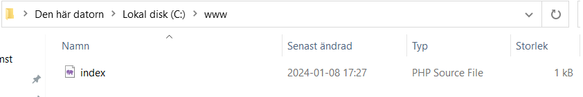
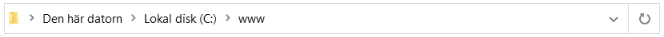
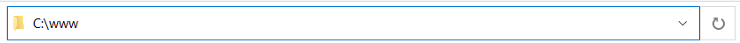

# Filsystem och sökvägar
## Filnamn och filtyp
På din dator så sparas filer och mappar, filer kan till exempel se ut på följande sätt:
```
index.html
profile.php
cat.png
instruction.md
```

Här har vi fyra filer som heter: index, profile, cat och instruction. Formaten på filerna är: html, php, png och md. Det finns tusentals olika filformat men det behövar man inte lära sig som tur är.
## Sökvägar
I exemplena ovan så har vi bara enskilda filer som existerar någonstans på vår dator. Vi kan vara mer explicita och ange antingen hela sökvägen till filen eller den relativa sökvägen till filen. Absoluta sökvägar till filerna hade kunnat se ut på följande sätt:
### Asboluta sökvägar
```
C:/www/plandigital/index.html
C:/www/blog/users/profile.php
C:/Pictues/Cats/cat.png
D:/work/assignments/instruction.md
```
Det första C: eller D: är namn på våra lagringsenheter på datorn, ofta kallade hårddiskar (ibland fel då vi oftast har SSD nu för tiden). Symbolen backslash **"\\"** används för att separera mappar från varandra och filer slutar alltid med filändelsen som representerar filtypen.
### Relativa sökvägar
```
./index.html
./users/profile.php
./img/dog.jpg
./assignments/instruction.md
```
Relativa sökvägar har du kanske stött på tidigare när du har länkat en bild eller CSS-fil inuti en HTML-fil. En sån hade kunnat se ut såhär för att läsa in en bild.
```html

```
För att den här sökvägen ska fungera måste filen vi skriver den i finnas i samma mapp som mappen ```img```. Strukturen hade kunnat sett ut på följande sätt förutsatt att det är i ```index.html``` som vi försöker läsa in bilden. Relativa sökvägar inleds med ```./``` som betyder "mappen vi för tillfället är i" eller ```../``` som betyder "ett steg ovanför mappen vi för tillfället är i".
```
img/
scripts/
index.html
```
Relativa sökvägar är bra att använda sig av på till exempel hemsidor då vi kanske inte alltid kan veta det absoluta sökvägen om vi laddar upp hemsidan till ett webbhotell till exempel.
### Exempel sökvägar
I instruktiorna [Installera Webbserver](./1.%20Installera%20Webbserver.md) så är det viktigt att du känner dig bekväm med sökvägar för att förstå instruktionerna. Här kommer några exempel med förklaringar
#### Exempel 1
Skapa mappen **C:\www** och i rooten till **www** skapa **index.php**.  Det är bara två steg som krävs.
1.  Navigera till **C:\\** och skapa en mapp som heter **www**.
1. Skapa en fil som heter **index.php** direkt i mappen **www**.

Du borde nu har ett resultat som ser ut såhär:


#### Exempel 2
Öppna filen **C:\apache24\conf\httpd.conf**
1. Gå till C:\
1. Gå mappen **apache24** som ligger i rooten av **C:\\**
1. Gå mappen **conf** som ligger i mappen **apache24**
1. Högerklicka och öppna filen **httpd.conf** med VS Code

### Tips
Du kan kopiera och klistra in sökvägar direkt i utforkaren.

Genom att klicka en gång så görs den om till ett vanligt textfält.

Du kan också sudda ut allt text och byta ut det mot "cmd" och trycka enter för att öppna terminalen i den mapp du står i.