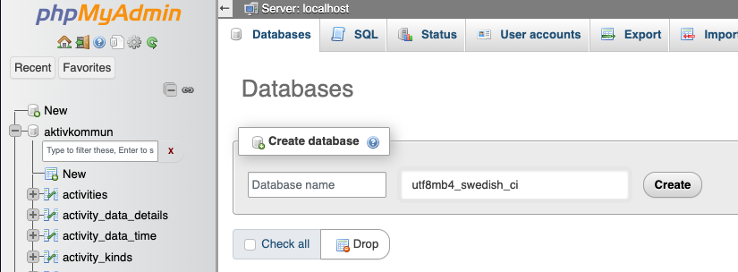

# Databaser, MySQL och PHP

För att kunna skapa nytt innehåll till våra hemsidor behöver vi använda oss av en databas av något slag. Men hjälp av den kan vi skapa, redigera eller ta bort innehåll utan att behöva redigera den faktiska koden för hemsidan vilken möjliggör interaktion från avnändare.

## 1. Skapa databas
Det finns flera sätt att skapa databaser, vi har tidigare laddat ned phpMyAdmin som är ett grafiskt gränssnitt för att hantera databaser. Om du har följt tidigare instruktioner till punkt och pricka ska du nu kunna surfa till [phpmyadmin.test](phpmyadmin.test).

Klicka på ```Databases``` och skapa en databas som heter ```blog```. Var noga med att välja den tecken-encoding som är vald på bilden, alltså ```utf8mb4_swedish_ci```.


## 2. Skapa tabell
För att ha någon som helst nytta av vår databas behöver vi såklart tabeller som lagrar vår information. 


